# HowdyAI: Graph-Based RAG Search Engine

<p align="left">
  <a href="https://www.python.org/downloads/"></a>
  <a href="https://opensource.org/licenses/MIT"></a>
  <a href="https://github.com/praddep/HowdyAI/pulls"></a>
  <a href="https://github.com/astral-sh/ruff"></a>
  <a href="https://github.com/hhatto/autopep8"></a>
  <br>
  <a href="https://streamlit.io/"></a>
  <a href="https://openai.com/"></a>
  <a href="https://www.trychroma.com/"></a>
  <a href="https://brave.com/search/api/"></a>
  <a href="https://langchain-ai.github.io/langgraph/"></a>
</p>

Agent-driven educational assistant and contextual search engine for Texas A&M University (TAMU). Users can ask complex questions about courses, university policies, degree plans, and faculty, and the system retrieves semantically relevant context from a localized university corpus, then re-ranks and synthesizes the results. The output is a highly faithful, properly cited answer with zero hallucinations.

This project targets the class of retrieval-augmented generation (RAG) problems that underpin specialized domain assistants: the gap between raw semantic search and factually accurate, hallucination-free generation. The technical contribution is the strict multi-stage LangGraph pipeline combined with an uncompromising Chain-of-Verification (CoV) evaluation methodology, ensuring the system reliably refuses unanswerable or adversarial queries rather than hallucinating.

## Table of Contents

- [Architecture](#architecture)
- [Directory Structure](#directory-structure)
- [Technical Stack](#technical-stack)
- [Configuration](#configuration)
- [Dataset](#dataset)
- [Retrieval Pipeline](#retrieval-pipeline)
- [LLM Prompt Templates](#llm-prompt-templates)
- [Safety & Query Rewriting](#safety--query-rewriting)
- [Evaluation](#evaluation)
- [Tests](#tests)
- [Docker Deployment](#docker-deployment)
- [CI/CD & Code Quality](#cicd--code-quality)
- [Setup and Installation](#setup-and-installation)
- [Usage](#usage)
- [Current Status](#current-status)
- [Roadmap](#roadmap)
- [Community & Policies](#community--policies)
- [Citation](#citation)


## Architecture

The system follows a multi-stage pipeline orchestrated by a LangGraph state machine. Each stage is a discrete, observable node — making the pipeline composable, auditable, and safe.

```
Stage 1: Guardrail & Cache
    User input
        -> Cache check against SQLite for immediate returns on repeat questions.
        -> Strict out-of-scope guardrail classification (IN_SCOPE / OUT_OF_SCOPE).
        -> Rejects adversarial prompts, jailbreaks, and non-TAMU queries instantly.

Stage 2: Query Rewriting
    Safe User input + Conversation History
        -> LLM rewrites the query to be dense and keyword-rich.
        -> Resolves pronouns (e.g., "where is it?" -> "where is the MSC at Texas A&M?").
        -> Expands domain abbreviations (e.g., "CSCE" -> "Computer Science and Engineering").

Stage 3: Hybrid Retrieval & Re-ranking
    Rewritten Query
        -> ChromaDB Cosine-similarity search against local embedded university corpus.
        -> Dynamic fallback to Brave Search for broad/live web queries.
        -> Local TF-IDF extraction for context boundary optimization.
        -> Cross-Encoder re-ranking to bubble up the most semantically relevant snippets.

Stage 4: Generation & Verification
    Re-ranked Context + User Query
        -> OpenAI generation with strict grounding instructions and inline citations.
        -> (Optional) Chain-of-Verification (CoV) judge evaluates the output.
        -> If hallucination detected, the pipeline automatically retries or safely refuses.
```

The key architectural insight is that vector retrieval alone is prone to semantic drift, and LLMs alone are prone to hallucination. The rigid LangGraph orchestration is what makes the pipeline composable, observable, and strictly auditable at every stage.

### End-to-End Pipeline Flow

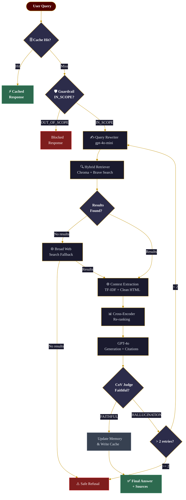

### LangGraph State Machine

Exact node graph as compiled by `build_pipeline_graph()` in `main.py`.

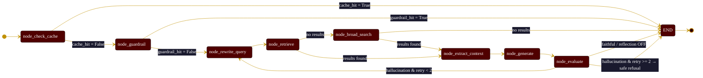

### C4 Context — System Ecosystem

High-level view of HowdyAI in its broader ecosystem of users, internal components, and external services.

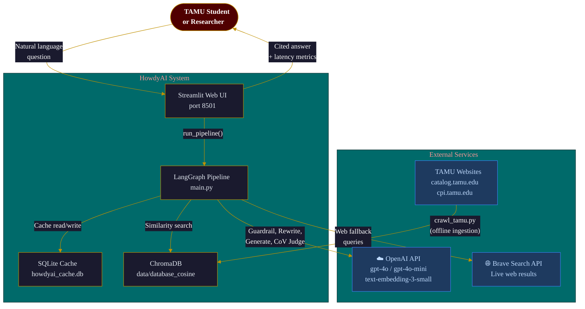


## Directory Structure

```text
HowdyAI/
|
|-- .github/                         # GitHub Configuration
|   |-- workflows/
|   |   |-- ci.yml                   # GitHub Actions CI pipeline (lint + test)
|   |-- ISSUE_TEMPLATE/
|   |   |-- bug_report.md            # Bug report template
|   |   |-- feature_request.md       # Feature request template
|   |-- PULL_REQUEST_TEMPLATE.md     # PR description template
|
|-- eval/                            # Rigorous Evaluation Suite
|   |-- run_master_eval.py           # End-to-end graph evaluation with CoV Judge
|   |-- run_retrieval_eval.py        # Standalone hybrid retrieval recall evaluation
|   |-- master_eval_dataset.json     # Ground-truth dataset (Factual + Adversarial queries)
|   |-- retrieval_qa_pairs.json      # QA pairs for retrieval-only evaluation
|   |-- benchmark_report.md          # Verified metric reports
|   |-- health_check.py              # API and system health validation
|
|-- src/                             # Core Application Engine
|   |-- search/
|   |   |-- hybrid_retriever.py      # Brave + Chroma orchestration and logic
|   |   |-- brave_search.py          # Brave Search API integration
|   |   |-- cross_encoder_ranker.py  # Cross-Encoder for context reranking
|   |   |-- query_rewriter.py        # Contextual query expansion logic
|   |   |-- data_processor.py        # TF-IDF context extraction and cleaning
|   |   |-- summarize_with_llm.py    # Snippet summarization
|   |
|   |-- language_models/
|   |   |-- language_model.py        # Abstract base class for LLMs
|   |   |-- openai_language_model.py # GPT-4o / GPT-4o-mini implementation
|   |
|   |-- templates/                   # LLM prompt templates
|   |   |-- chat_template.txt        # Main generation grounding instructions
|   |   |-- guardrail_template.txt   # Out-of-scope classification prompt
|   |   |-- rewrite_template.txt     # Query expansion prompt
|   |   |-- summary_template.txt     # Snippet summarization prompt
|   |   |-- rank_template.txt        # Cross-encoder ranking prompt
|   |
|   |-- database.py                  # ChromaDB vector store wrapper (Cosine Metric)
|   |-- guardrail.py                 # LangGraph guardrail node logic
|   |-- embeddings.py                # Local/Remote embedding models
|   |-- memory.py                    # Multi-turn conversation history (6-turn window)
|   |-- cache.py                     # SQLite response caching layer
|   |-- metrics.py                   # Observability and telemetry logging
|
|-- scripts/
|   |-- migrations/                  # Database migration and deduplication utilities
|       |-- dedup_chroma.py          # Cleans duplicate embeddings from the vector store
|       |-- migrate_chroma.py        # Updates index configurations (L2 -> Cosine)
|       |-- patch_chroma_urls.py     # Standardizes source URL metadata
|
|-- tests/                           # Comprehensive unit and integration tests
|   |-- test_cache.py                # SQLite cache layer tests
|   |-- test_chunking.py             # Document chunking tests
|   |-- test_database.py             # ChromaDB wrapper tests
|   |-- test_embeddings.py           # Embedding model tests
|   |-- test_guardrail.py            # Guardrail classification tests
|   |-- test_hybrid_retriever.py     # Hybrid retriever unit tests
|   |-- test_hybrid_retriever_coverage.py # Extended retriever coverage tests
|   |-- test_integration.py          # End-to-end pipeline integration tests
|   |-- test_memory.py               # Conversation memory tests
|   |-- test_metrics.py              # Telemetry and observability tests
|   |-- test_openai_language_model.py # OpenAI LLM wrapper tests
|   |-- test_query_rewriter.py       # Query rewriting tests
|   |-- test_summarize_with_llm.py   # Summarization tests
|
|-- data/                            # Local data storage (crawled HTML, ChromaDB index)
|-- logs/                            # Runtime logs (debug.log, info.log, error.log)
|-- app.py                           # Streamlit UI Entrypoint
|-- main.py                          # LangGraph Orchestrator (pipeline state machine)
|-- config.py                        # Global hyperparameter configuration (AppConfig)
|-- crawl_tamu.py                    # Web scraper for building the university corpus
|-- create_database.py               # Ingestion pipeline for ChromaDB
|-- Dockerfile                       # Docker container definition
|-- .dockerignore                    # Files excluded from Docker build context
|-- .env.example                     # Example environment variable template
|-- .pre-commit-config.yaml          # Pre-commit hooks (autopep8, ruff, trailing whitespace)
|-- requirements.txt                 # Python package dependencies
|-- CHANGELOG.md                     # Version history and notable changes
|-- CITATION.cff                     # Machine-readable citation metadata
|-- LICENSE                          # MIT License
```

### Project Mind Map

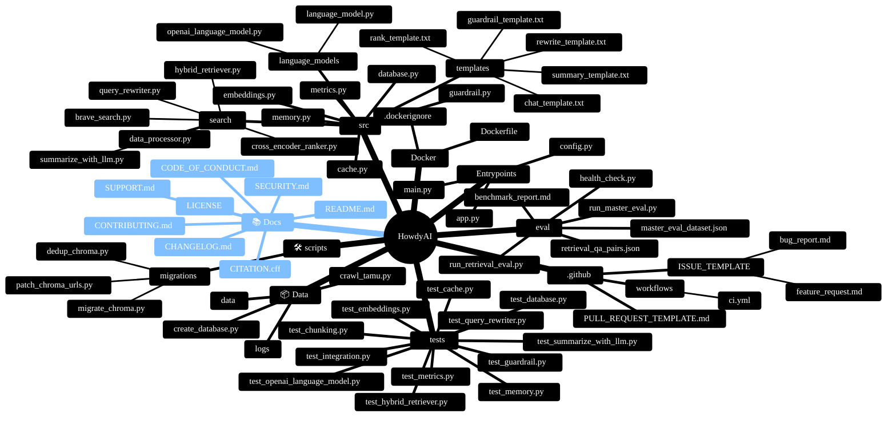


## Technical Stack

### Orchestration: LangGraph
The core state machine uses LangGraph to manage the lifecycle of a query. This allows for cyclical graphs (e.g., retrying retrieval if a hallucination is detected) and explicit state tracking at every node.

### Vector Database: ChromaDB
We use ChromaDB initialized with the **Cosine** distance metric. Documents are chunked and embedded using OpenAI's `text-embedding-3-small` (or configurable local variants).

### Cross-Encoder Re-Ranking
Instead of relying solely on the Cosine similarity of the bi-encoder embeddings, the system implements a Cross-Encoder step on the retrieved chunks to drastically improve precision, effectively pushing the most relevant exact-match snippets to the top of the context window.

### Generation & Evaluation: OpenAI
The system uses `gpt-4o-mini` for fast internal routing (guardrails, query rewriting) and `gpt-4o` as the strong generator model and Chain-of-Verification judge.

### Web Search Fallback: Brave Search API
When local vector retrieval confidence is low, or a query requires live web context, the Brave Search API is invoked to fetch and scrape fresh web pages dynamically.

### Frontend: Streamlit
A ChatGPT-like interface with custom CSS, visual status badges, inline citations, and a real-time Admin Dashboard for monitoring cache hit rates, guardrail block rates, and average latency.

### Module Dependency Graph

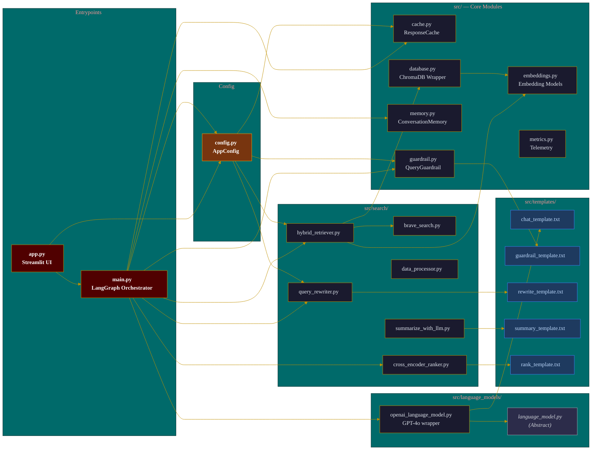


## Configuration

All system-wide hyperparameters are managed through the `AppConfig` class in `config.py`. The key parameters are:

| Parameter | Default | Description |
|---|---|---|
| `FAST_MODEL` | `gpt-4o-mini` | Model for guardrails and query rewriting |
| `STRONG_MODEL` | `gpt-4o` | Model for generation and CoV judge |
| `CHROMA_NUM_RESULTS` | `10` | Number of candidate chunks from ChromaDB |
| `NUM_SEARCH_RESULTS` | `5` | Number of results from Brave Search |
| `FUSION_TOP_N` | `12` | Top candidates passed to the Cross-Encoder |
| `RANKER_TOP_K` | `8` | Final top-K snippets after re-ranking |
| `MEMORY_MAX_TURNS` | `6` | Maximum conversation turns stored in memory |
| `USE_REFLECTION` | `False` | Enable/disable CoV retry loop |
| `USE_HYDE` | `False` | Enable/disable HyDE query expansion |

Environment variables are loaded from a `.env` file. See `.env.example` for the required keys.


## Dataset

### Scraping and Ingestion
The corpus is dynamically generated via the `crawl_tamu.py` and `create_database.py` pipeline.
1. The scraper systematically downloads official university pages, catalogs, and department websites.
2. The HTML is cleaned, stripped of boilerplate, and chunked contextually.
3. Chunks are embedded and stored in the local `data/database_cosine` Chroma directory.

### Seed Data
The system currently indexes key domains like `catalog.tamu.edu`, `cpi.tamu.edu`, and other core university resources, resulting in a dense, localized knowledge base of course prerequisites, university policies, and faculty details.

### Data Flow & Storage Architecture

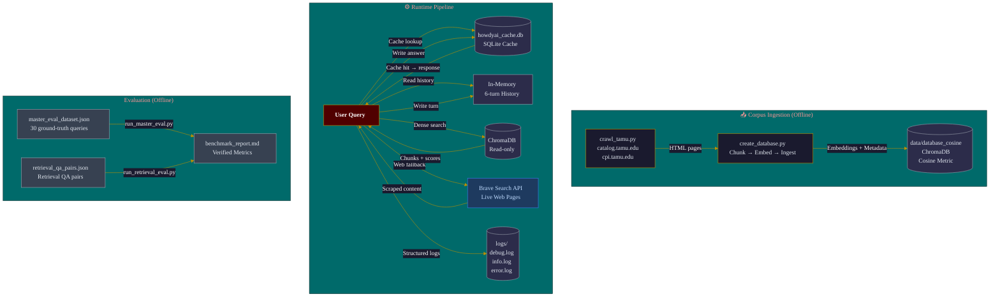

### Entity Relationship Diagram

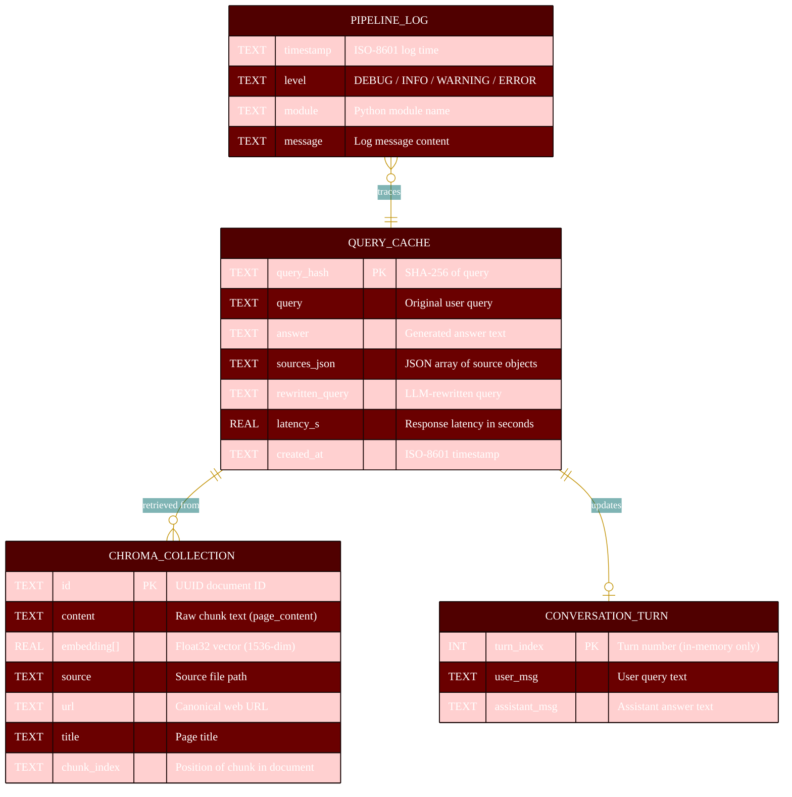


## Retrieval Pipeline

The retrieval pipeline is the second stage of the system. When a query passes the guardrail:

1. **Local Search:** The rewritten query is embedded and searched against ChromaDB using exact Cosine similarity, returning a broad set of candidate chunks.
2. **Fallback / Web Search:** If local confidence is low, or if the query requires broad web context, the Brave Search API fetches live links, which are scraped dynamically.
3. **TF-IDF Extraction:** The raw HTML of the retrieved documents is processed locally to extract the most relevant sentences.
4. **Cross-Encoder Ranking:** The extracted snippets are re-ranked by the Cross-Encoder.
5. **Context Window Assembly:** The top results are compiled into a strict context block, capped at 8,000 words, and injected into the generation prompt with explicit source indexing.

### Hybrid Retrieval Sub-Pipeline

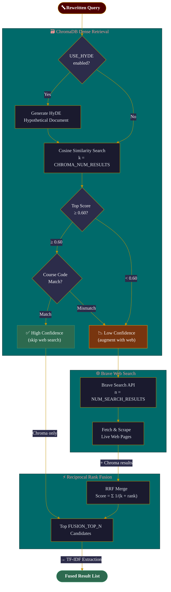

### User Interaction Sequence

End-to-end sequence for a typical factual query, showing component interactions.

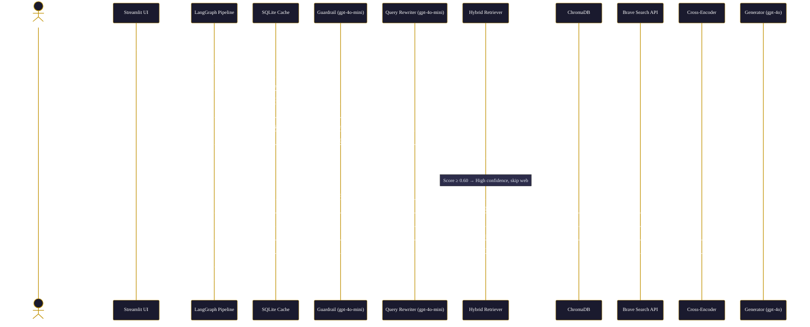


## LLM Prompt Templates

All prompts are managed as plain-text files in `src/templates/`:

| Template | Purpose |
|---|---|
| `chat_template.txt` | Main generation grounding instructions; enforces citation and hallucination refusal |
| `guardrail_template.txt` | Classifies query as `IN_SCOPE` or `OUT_OF_SCOPE` |
| `rewrite_template.txt` | Expands abbreviated or ambiguous queries using conversation history |
| `summary_template.txt` | Summarizes raw web-scraped snippets for context injection |
| `rank_template.txt` | Prompt for LLM-assisted re-ranking step |


## Safety & Query Rewriting

The pre-processing nodes (`guardrail.py` and `query_rewriter.py`) are critical technical contributions that prevent abuse and improve accuracy.

### Out-of-Scope Guardrail
The system checks every query against a strict policy. Queries attempting prompt injection, jailbreaks, cheating, or asking for off-topic world facts are instantly blocked with a `guardrail_hit`. This ensures the system remains a focused educational tool and cannot be exploited to generate inappropriate content.

### Query Rewriting
"Is it offered in the fall?" is a terrible search query. The query rewriter utilizes the conversation history to resolve pronouns, expand acronyms, and inject necessary domain keywords (e.g., "Is CSCE 670 offered in the Fall semester at Texas A&M?"), drastically improving vector retrieval scores.


## Evaluation

The defining feature of this project is its uncompromising evaluation methodology. The system relies on a **Chain-of-Verification (CoV)** LLM-as-a-judge to mathematically score the system against a hand-curated, corpus-anchored ground truth dataset (`master_eval_dataset.json`).

### Benchmark Results

Results from the `run_master_eval.py` pipeline evaluated on a 30-query test set (15 factual queries, 15 adversarial/out-of-scope queries):

| Metric | Result |
|--------|--------|
| Queries evaluated | 30 |
| Overall Combined Avg Latency | **3.63 seconds** |
| Factual/Full-Pipeline Avg Latency | 6.22 seconds |
| Guardrail-Refusal Avg Latency | 1.04 seconds |
| Factual Faithfulness | **100.0%** (15/15) |
| Adversarial Guardrail Success | **100.0%** (15/15) |
| Hybrid Retrieval Recall@10 | **86.67%** (13/15) |
| CoV Retries | 0 |

The 100% factual faithfulness score proves the system correctly identifies and extracts answers from the corpus, completely eliminating hallucinations. The 100% guardrail success proves the system is fully robust against adversarial injections and off-topic questions.

See the full breakdown in [`eval/benchmark_report.md`](eval/benchmark_report.md).

To reproduce:
```bash
python eval/run_master_eval.py
python eval/run_retrieval_eval.py
```

### Evaluation Pipeline

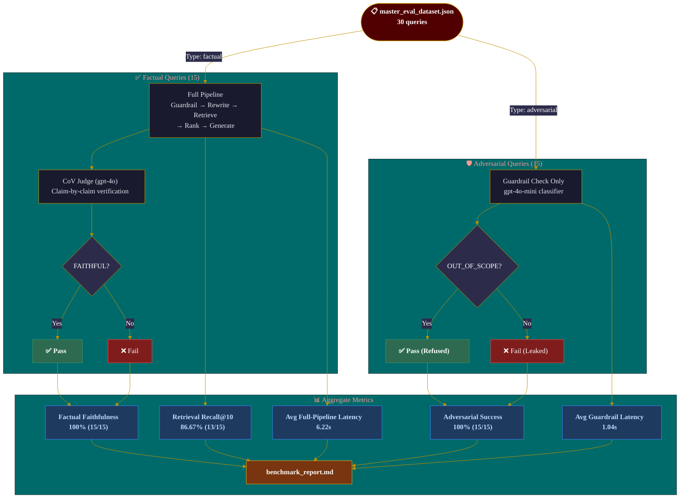

### Health Check

Before running evaluations, validate that all APIs and system components are functional:
```bash
python eval/health_check.py
```


## Tests

The `tests/` directory contains 13 test modules covering unit and integration testing across all major system components. Tests are run with `pytest` and coverage is enforced at a minimum of 70%.

```bash
# Run all tests with coverage
pytest tests/ --cov=src --cov=main --cov-report=term-missing

# Run a specific module
pytest tests/test_guardrail.py -v
```

Test coverage includes: cache, chunking, ChromaDB, embeddings, guardrail, hybrid retriever, integration pipeline, conversation memory, telemetry metrics, OpenAI LLM wrapper, query rewriter, and summarization.


## Docker Deployment

The application is fully containerized. The `Dockerfile` uses a `python:3.10-slim` base image and exposes port `8501` for the Streamlit server.

```bash
# Build the image
docker build -t howdyai .

# Run the container
docker run -p 8501:8501 --env-file .env howdyai
```

The `.dockerignore` file excludes `.venv`, `data/`, `logs/`, and other non-essential files from the build context.


## CI/CD & Code Quality

### GitHub Actions CI
The `.github/workflows/ci.yml` pipeline automatically runs on every push and pull request to `main`. It:
1. Sets up Python 3.10
2. Installs all dependencies from `requirements.txt`
3. Lints the codebase with `ruff`
4. Runs all `pytest` tests with coverage enforcement (≥70%)

### Pre-commit Hooks
The `.pre-commit-config.yaml` enforces code quality on every local commit:
- **autopep8**: Auto-formats Python code
- **ruff**: Fast linting
- **trailing-whitespace**: Removes trailing whitespace
- **end-of-file-fixer**: Ensures files end with a newline
- **check-yaml**: Validates YAML syntax
- **check-merge-conflict**: Prevents committing merge conflict markers

Install the hooks with:
```bash
pip install pre-commit
pre-commit install
```

### CI/CD Pipeline Diagram

```mermaid
%%{init: {'theme': 'base', 'themeVariables': {'primaryColor': '#500000', 'primaryTextColor': '#fff', 'lineColor': '#c09000', 'edgeLabelBackground': '#1a1a2e', 'fontFamily': 'Inter, sans-serif'}}}%%
flowchart LR
    PUSH(["git push / PR\nto main"]):::trigger

    subgraph GHA ["  GitHub Actions (ubuntu-latest)  "]
        CHECKOUT["actions/checkout@v3"]:::step
        PYTHON["Setup Python 3.10\nactions/setup-python@v4"]:::step
        INSTALL["pip install -r requirements.txt\npip install pytest pytest-cov ruff"]:::step
        LINT["ruff check ."]:::step
        TEST["pytest tests/\n--cov=src --cov=main\n--cov-fail-under=70"]:::step
        LINT_OK{"Lint\nPassed?"}:::decision
        TEST_OK{"Coverage\n≥ 70%?"}:::decision
        SUCCESS["✅ CI Green"]:::success
        FAIL["❌ CI Failed"]:::danger
    end

    subgraph LOCAL ["  Local Pre-commit Hooks  "]
        PC1["autopep8\nauto-format"]:::hook
        PC2["ruff\nlinting"]:::hook
        PC3["trailing-whitespace\nend-of-file-fixer"]:::hook
        PC4["check-yaml\ncheck-merge-conflict"]:::hook
    end

    PUSH --> CHECKOUT --> PYTHON --> INSTALL --> LINT --> LINT_OK
    LINT_OK -->|"Pass"| TEST --> TEST_OK
    LINT_OK -->|"Fail"| FAIL
    TEST_OK -->|"Pass"| SUCCESS
    TEST_OK -->|"Fail"| FAIL

    LOCAL -->|"Blocks commit"| PUSH

    classDef trigger fill:#500000,stroke:#c09000,color:#fff,font-weight:bold
    classDef step fill:#1a1a2e,stroke:#c09000,color:#e2e8f0
    classDef decision fill:#2c2c4a,stroke:#c09000,color:#fff
    classDef success fill:#2d6a4f,stroke:#40916c,color:#fff,font-weight:bold
    classDef danger fill:#7f1d1d,stroke:#ef4444,color:#fff
    classDef hook fill:#78350f,stroke:#f59e0b,color:#fff
```


## Setup and Installation

### Prerequisites

- Python 3.10 or higher
- OpenAI API Key
- Brave Search API Key

### Step 1: Clone and Environment

```bash
git clone <repository-url>
cd HowdyAI
python -m venv .venv
source .venv/bin/activate  # On Windows: .venv\Scripts\activate
pip install -r requirements.txt
```

### Step 2: Configure Keys

Copy `.env.example` to `.env` and fill in your keys:
```bash
cp .env.example .env
```

```env
OPENAI_API_KEY=your_openai_key
BRAVE_API_KEY=your_brave_key
```

### Step 3: Build the Corpus (Optional)

If you want to build a fresh local vector database:
```bash
python crawl_tamu.py        # Crawl TAMU web pages
python create_database.py   # Embed and ingest into ChromaDB
```

### Step 4: Run the Application

```bash
streamlit run app.py
```


## Usage

Once the Streamlit server is running, navigate to `http://localhost:8501`.

The UI provides a ChatGPT-like interface where you can:
- Ask questions about TAMU courses and policies.
- View inline citations and source links for every generated answer.
- Monitor the real-time **Admin Dashboard** in the sidebar to see Cache Hit Rates, Guardrail Block Rates, and Average Latency metrics.


## Current Status

### Implemented

- Complete LangGraph orchestration pipeline with distinct Guardrail, Rewrite, Retrieve, Rank, and Generate nodes.
- High-performance Streamlit frontend with custom CSS, visual badges, and an administrative telemetry dashboard.
- Exact course code matching to prevent false-positive semantic retrieval of similar course numbers.
- Comprehensive `run_master_eval.py` evaluation suite providing verifiable Faithfulness and Guardrail metrics.
- Standalone `run_retrieval_eval.py` for isolated hybrid retrieval recall measurement.
- SQLite-based caching layer for sub-second responses on identical queries.
- 13-module test suite with ≥70% code coverage enforcement via CI.
- Clean `.dockerignore` and optimized `Dockerfile` for streamlined containerized deployment.
- GitHub Actions CI pipeline for automated linting and testing.
- Pre-commit hook configuration for consistent local code quality.

### Known Limitations

- Running `create_database.py` to index the entire TAMU web domain is time-consuming; the current seed database focuses on high-value catalogs and directories.


## Roadmap

### Phase 2: Deployment and Scale
Deploy the application via Docker to a cloud provider. Implement a scheduled CRON job to automatically run the `crawl_tamu.py` pipeline once a month to ensure the vector database stays synchronized with the latest university catalog updates.

### Phase 3: Expanded Coverage
Extend the scraper to cover additional TAMU domains including student organization directories, housing resources, and financial aid portals.


## Community & Policies

- [Changelog](CHANGELOG.md)
- [Contributing](CONTRIBUTING.md)
- [Code of Conduct](CODE_OF_CONDUCT.md)
- [Support](SUPPORT.md)
- [Security](SECURITY.md)
- [License](LICENSE)


## Citation

If you use this software in your research or project, please cite it:

```bibtex
@software{howdyai,
  author = {Praddep},
  title = {HowdyAI: Graph-Based RAG Search Engine},
  year = {2026},
  url = {https://github.com/praddep/HowdyAI}
}
```

---
<p align="center">Made with ❤️ by Pradeep Periyasamy</p>
